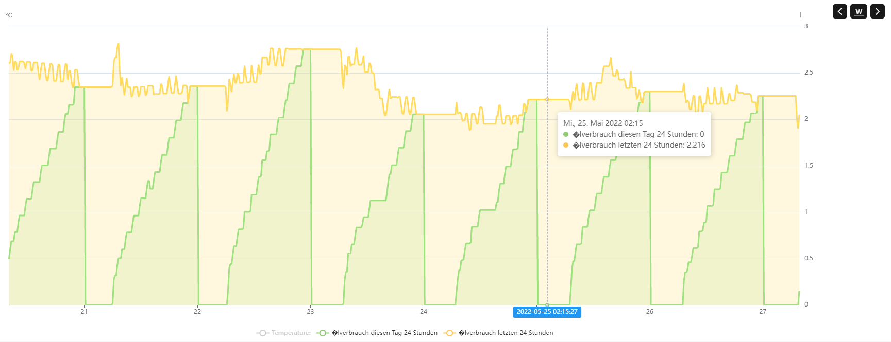

# Fuel oil counter
Fuel oil counter with Modbus (operating hours counters to calculate the fuel oil consumption).
Calculation of the consumption based on the set nozzle liter consumption.

## Parameter
operating voltage: 5V
output signal: RS-485
communication protocol: Modbus RTU
communication address: 1 ~ 247 (Standard 1)

## OpenHab example

## programming table SW1

The factor for the calculation of the heating oil is set with the dip switch SW1.

| 1   | 2   | 3   | 4   | 5   | oil kg per hour|
|:---:|:---:|:---:|:---:|:---:|:--------------:|
| off | off | off | off | off | 1.45           |
| off | off | off | off | on  | 1.5            |
| off | off | off | on  | off | 1.55           |
| off | off | off | on  | on  | 1.6            |
| off | off | on  | off | off | 1.65           |
| off | off | on  | off | on  | 1.7            |
| off | off | on  | on  | off | 1.75           |
| off | off | on  | on  | on  | 1.8            |
| off | on  | off | off | off | 1.85           |
| off | on  | off | off | on  | 1.9            |
| off | on  | off | on  | off | 1.95           |
| off | on  | off | on  | on  | 2              |
| off | on  | on  | off | off | 2.05           |
| off | on  | on  | off | on  | 2.1            |
| off | on  | on  | on  | off | 2.15           |
| off | on  | on  | on  | on  | 2.2            |
| on  | off | off | off | off | 2.25           |
| on  | off | off | off | on  | 2.3            |
| on  | off | off | on  | off | 2.35           |
| on  | off | off | on  | on  | 2.4            |
| on  | off | on  | off | off | 2.45           |
| on  | off | on  | off | on  | 2.5            |
| on  | off | on  | on  | off | 2.55           |
| on  | off | on  | on  | on  | 2.6            |
| on  | on  | off | off | off | 2.65           |
| on  | on  | off | off | on  | 2.7            |
| on  | on  | off | on  | off | 2.75           |
| on  | on  | off | on  | on  | 2.8            |
| on  | on  | on  | off | off | 2.85           |
| on  | on  | on  | off | on  | 2.9            |
| on  | on  | on  | on  | off | 2.95           |
| on  | on  | on  | on  | on  | 3              |

## Modbus Protocol
### Function codes
        
|command register| function                  |
|----------------|---------------------------|
| 0x03           | read keep register        |
| 0x04           | read input register       |
| 0x06           | write a single register   |
| 0x10           | write more keep registers |

### Registers

|regsiter type   | register address | gegister contents   | bytes | register - ID  |
|----------------|------------------|---------------------|-------|----------------|
| input register | 0x0001           | ml summary Hi Byte  |   2   |  1             | 
| input register | 0x0002           | ml summary Low Byte |   2   |  2             | 
| input register | 0x0003           | s summary Hi Byte   |   2   |  3             | 
| input register | 0x0004           | s summary Low Byte  |   2   |  4             | 
| input register | 0x0005           | ms time   Hi Byte   |   2   |  5             | 
| input register | 0x0006           | ms time   Low Byte  |   2   |  6             |
| input register | 0x0007           | l summary           |   2   |  7 (EEPROM)    |
| input register | 0x0008           | h active summary    |   2   |  8 (EEPROM)    |
| debug register | 0x0009           | DIP value           |   2   |  9             |
| debug register | 0x0010           | gram per hour       |   2   |  10            |
| debug register | 0x0011           | ml per hour         |   2   |  11            |
| debug register | 0x0012           | fw version          |   2   |  12            |
| keep register  | 0x0013           | device address      |   2   |  13 (EEPROM)   |
| keep register  | 0x0014           | baud rate           |   2   |  14 (EEPROM)   |
| keep register  | 0x0015           | reset summary       |   2   |  15            |

baudrate = 0 =>  9600 baud
           1 => 14400 baud
           2 => 19200 baud
